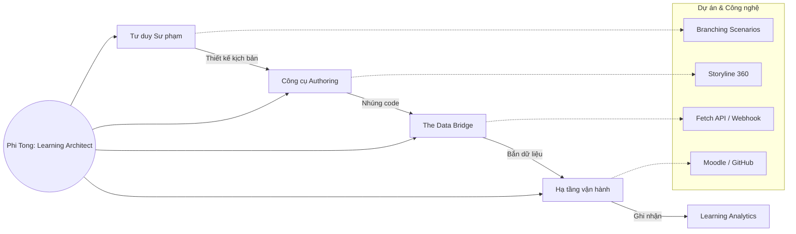
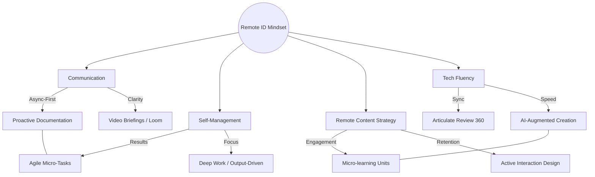

# 💎 TITANIUM GLOSSARY & SKILL MASTER (V1.0)
**Mục đích:** Tổng hợp toàn bộ "kho vũ khí" thuật ngữ và kỹ năng mày đã xây dựng cùng Antigravity. Dùng để tra cứu, học thuộc và chuẩn bị cho các buổi phỏng vấn Senior level.

---

## 🧠 TITANIUM LEARNING ECOSYSTEM FLOW

---

## 1. INSTRUCTIONAL DESIGN & PEDAGOGY (Sư phạm & Thiết kế)

| Thuật ngữ | Giải thích đơn giản | Talkpoint cho Phỏng vấn |
|---|---|---|
| **Branching Scenario** | Kịch bản rẽ nhánh (Dự án Simulator). Học viên chọn A sẽ đi hướng khác chọn B. | "I use **branching scenarios** to simulate high-stakes environments where learners must deal with real-world consequences." |
| **Needs Analysis** | Phân tích nhu cầu. Tìm hiểu tại sao cần đào tạo trước khi bắt đầu làm slide. | "My design process always starts with a thorough **needs analysis** to ensure the training addresses actual performance gaps." |
| **Asynchronous Learning** | Học bất đồng bộ. Học viên tự học trên máy tính, không cần giáo viên đứng lớp online/offline cùng lúc. | "I specialize in creating **asynchronous** experiences that maintain high engagement without direct supervision." |
| **Scaffolding** | Giàn giáo kiến trúc. Chia nhỏ kiến trúc từ dễ đến khó để học viên không bị ngợp. | "I implement **instructional scaffolding** to gradually build learner confidence in complex topics like Project Management." |

---

## 2. LMS & LEARNING TECHNOLOGY (Công nghệ giáo dục)

| Thuật ngữ | Giải thích đơn giản | Talkpoint cho Phỏng vấn |
|---|---|---|
| **LMS (Learning Management System)** | Hệ thống quản lý học tập (Moodle, Canvas...). Nơi chứa khóa học và quản lý học viên. | "I have hands-on experience administering and customizing **Moodle LMS** to drive activity completion." |
| **xAPI (Experience API)** | Một tiêu chuẩn dữ liệu mới (xịn hơn SCORM). Cho phép theo dõi hành vi chi tiết như "Học viên đã bấm vào nút nào". | "Using **xAPI logic**, I can track granular behaviors that traditional SCORM packages often miss." |
| **SCORM** | Tiêu chuẩn đóng gói khóa học cũ nhưng phổ biến nhất. | "While I'm proficient in **SCORM** standards, I prefer hybrid data solutions for more detailed analytics." |
| **Authoring Tools** | Công cụ soạn thảo khóa học (Storyline, Rise, Lectora...). | "I am an expert in **Rapid Authoring Tools** like Articulate 360, focusing on interactive and responsive design." |

---

## 3. ADVANCED DATA & WEB TECH (Công nghệ bậc cao)

| Thuật ngữ | Giải thích đơn giản | Talkpoint cho Phỏng vấn |
|---|---|---|
| **JSON** | Một định dạng gói dữ liệu (như cái thùng carton chứa đồ để gửi đi). | "The data is transmitted in **JSON format** to ensure compatibility between Storyline and our backend dashboard." |
| **Webhook** | Một cái "tai nghe" tự động. Khi có dữ liệu gửi tới link đó, nó sẽ tự động chạy lệnh. | "I configured a **Webhook** using Google Apps Script to serve as a real-time bridge between learning and analytics." |
| **Fetch API** | Phương thức JavaScript để "bắn" dữ liệu đi mà không làm đứng máy. | "Using the **Fetch API**, we can send learning data asynchronously to our external database." |
| **regex (Regular Expression)** | Bộ lọc ký tự (Dùng để kiểm tra email đúng định dạng hay không). | "I implemented **regex validation** to maintain data integrity within our reporting pipeline." |
| **Serverless Architecture** | Kiến trúc không máy chủ (Dùng Google Script thay vì thuê server). | "My **serverless** approach allows the company to collect advanced analytics with zero monthly hosting costs." |

---

## 4. 🧠 BÀI TEST THỰC TẾ (PHỎNG VẤN THỬ)

Mày hãy thử tự trả lời các câu hỏi sau bằng tiếng Anh (hoặc tiếng Việt tao sẽ dịch giúp):

1.  **"How did you track learner behavior in your Simulator without an LMS?"**
    *   *Gợi ý:* Nói về JavaScript, Fetch API và Google Apps Script Webhook.
2.  **"What is the advantage of a branching scenario over a linear quiz?"**
    *   *Gợi ý:* Nói về Critical Thinking và mô phỏng thực tế.
3.  **"Describe a time you used data to improve learning."**
    *   *Gợi ý:* Nói về việc dùng dữ liệu ở Google Sheets để phân tích xem học viên hay "ngã" ở lựa chọn nào.

---

## 🌐 5. REMOTE CAREER SUCCESS MATRIX (Vận hành & Tư duy Remote)

### 🧠 Giải nghĩa cho phỏng vấn Remote:
- **Async-First:** "Tôi ưu tiên làm việc bất đồng bộ để đảm bảo tiến độ dự án không bị gián đoạn bởi sự khác biệt múi giờ."
- **Proactive Documentation:** "Tôi duy trì thói quen viết báo cáo hệ thống (Update Log) mỗi ngày để sếp và đồng nghiệp luôn nắm bắt được trạng thái công việc mà không cần họp hành nhiều."
- **AI-Augmented:** "Tôi sử dụng trí tuệ nhân tạo (AI) như một trợ lý thiết kế để tăng tốc độ sản xuất nội dung lên gấp nhiều lần, giúp tối ưu hóa ROI cho công ty."

---
*File này sẽ được AI tự động cập nhật mỗi khi có kỹ năng mới xuất hiện. Mày nhớ đọc nó mỗi tuần 1 lần nhé!*
