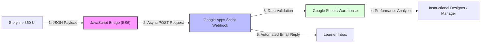
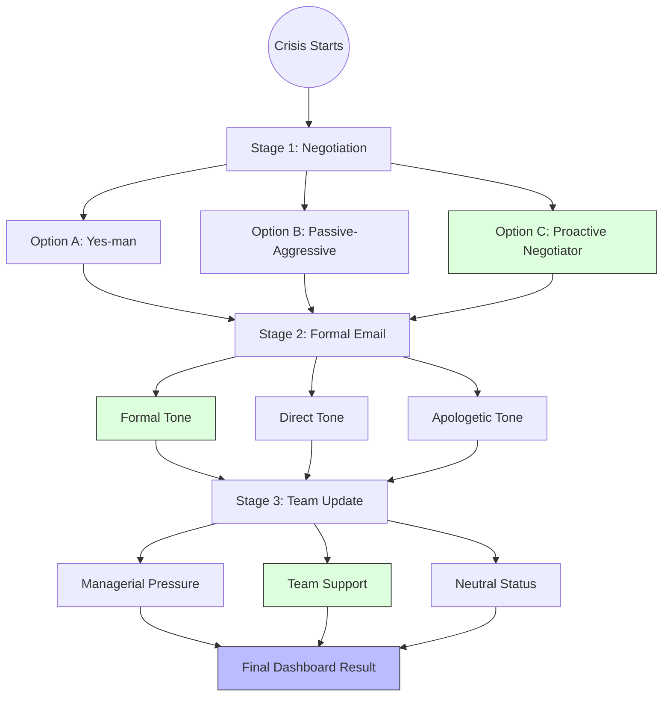
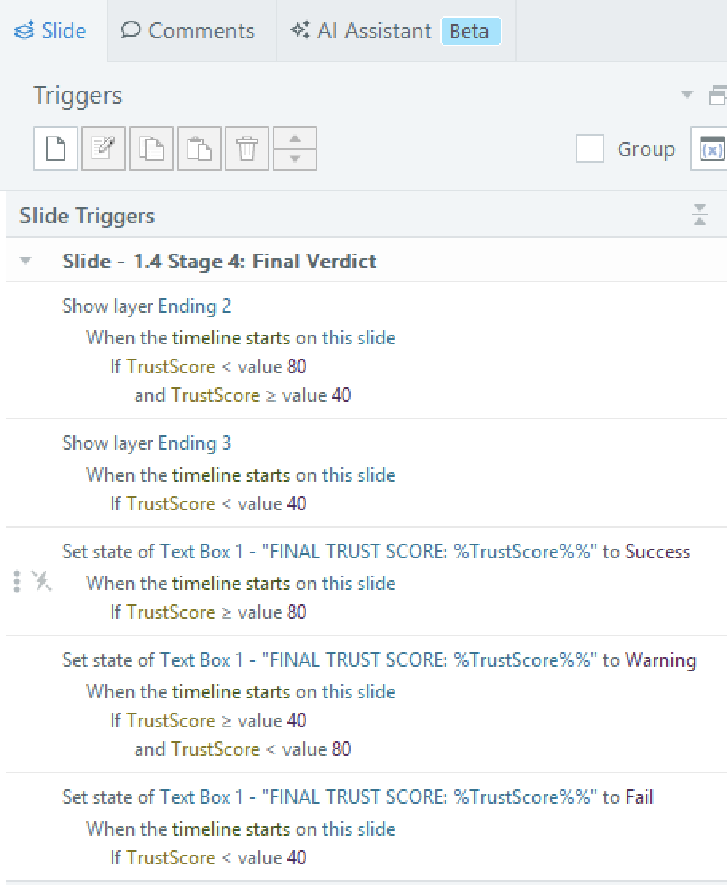
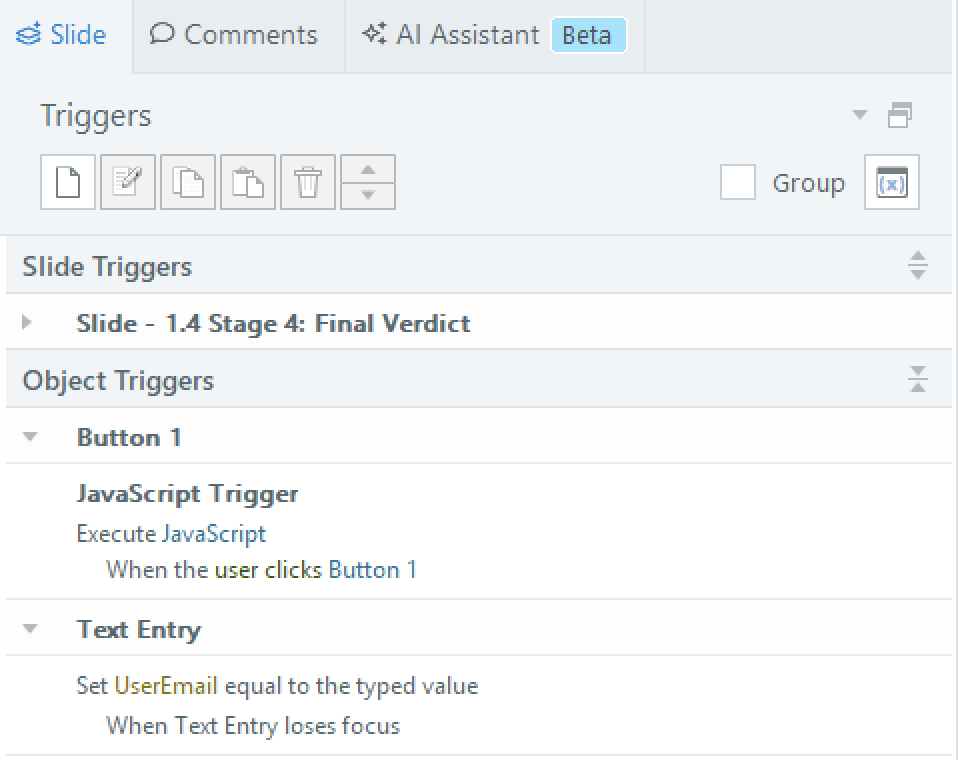
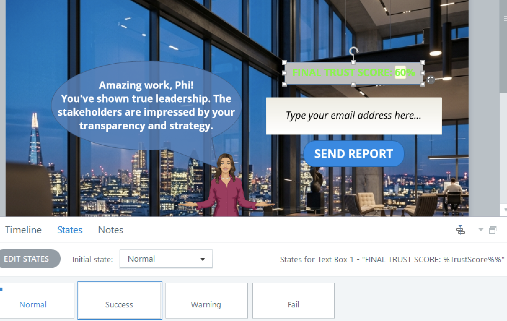
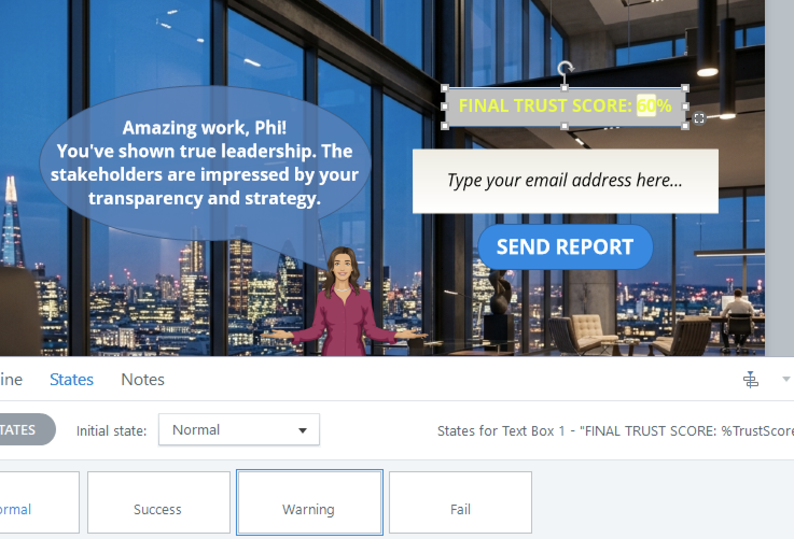
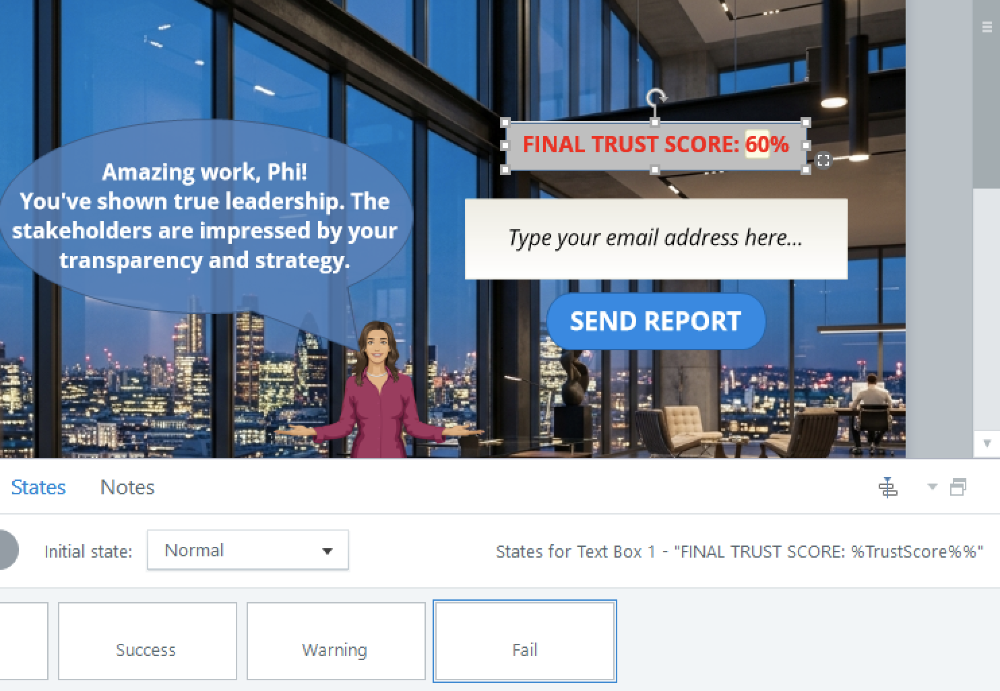
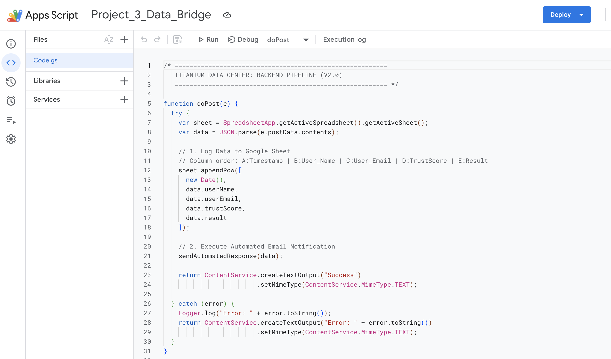
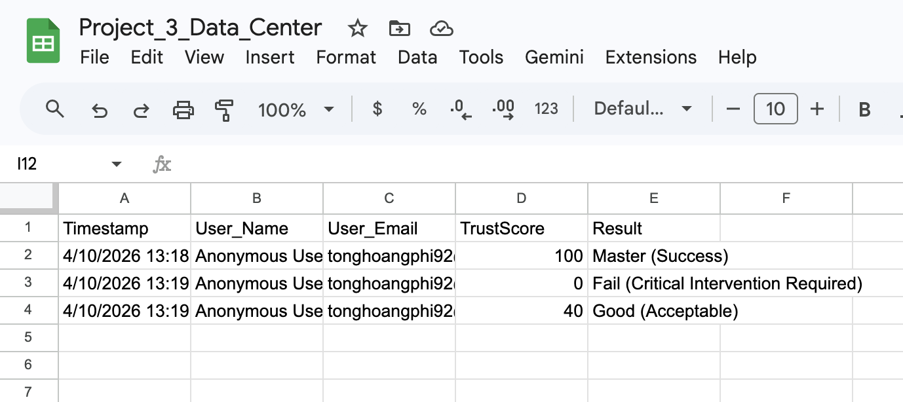

# CASE STUDY: THE DEADLINE CRISIS
## Adaptive Learning & Automation Architecture (The Titanium Simulator)

> **Author:** Phi Tong
> **Role:** Senior Learning Experience Architect
> **Tools:** Articulate Storyline 360, JavaScript (ES6), Google Apps Script, Google Sheets.

---

## 1. THE PROBLEM
In high-stakes corporate environments, communication during a "Project Crisis" is often the difference between success and total failure. Standard e-learning (scrolling pages with quizzes) fails to simulate the **cumulative psychological impact** of communication choices. Learners need to feel the "weight" of their decisions on stakeholder trust.

## 2. THE SOLUTION: THE TITANIUM SIMULATOR
An adaptive, branching-scenario simulator where every word matters. The system tracks user behavior in real-time using a custom **TrustScore**, and provides automated, data-driven feedback through a seamless external pipeline.

### High-Level Data Architecture:

### Core Architecture:
- **Dynamic Branching:** 3 Stages of crisis management (Negotiation, Formal Strategy, Team Alignment).
- **Behavioral Analytics:** Real-time tracking of "Trust Capital."
- **Data Pipeline:** E-learning (SL360) ➔ JavaScript Bridge ➔ Google Apps Script Webhook ➔ Google Sheets.

---

## 3. THE BEHAVIORAL JOURNEY (STAGE-BY-STAGE ANALYSIS)

### Decision Flow Map:

### STAGE 1: THE DEADLINE NEGOTIATION (Mastering Scope)
**The Scenario:** A client demands an impossible 72-hour turnaround for a massive project. 
**The Logical Trap:** Most learners fall into the "Yes-man" trap—accepting the deadline without conditions to avoid immediate conflict. 
- **The Outcome:** While "Yes" gives an immediate TrustScore boost, the simulator logs this as a **High-Risk Behavioral Pattern**.
- **The Senior Choice:** Negotiating the project scope while holding the deadline firm. This is the only choice that secures long-term Project Integrity.

*Caption: Stage 1 logical branching - Balancing stakeholder pressure with resource reality.*

### STAGE 2: THE FORMAL STRATEGY (Diplomatic Tones)
**The Scenario:** Following the negotiation, the learner must craft a formal strategy email to the Client (The Stakeholder).
**The Psychological Challenge:** Choosing a tone that is neither too apologetic (Submissive) nor too robotic (Detached).
- **Mastery:** A "Diplomatic & Solution-Focused" tone. This stabilizes the TrustScore and unlocks the "Success Path."
- **Failure:** Over-promising to please the client, which sets the project up for a hidden "Failure state" later in the simulation.

### STAGE 3: THE TEAM ALIGNMENT (Leading Through Crisis)
**The Scenario:** After managing the client, the project lead must update their internal production team on the 48-hour "Sprint." 
**The Leadership Gate:** Many managers focus only on the client and forget the internal team.
- **Fail Result:** Demanding performance without empathy. This causes the TrustScore to plummet to the **"Absolute Disaster" (Red)** state, regardless of previous successes.
- **Win Result:** Transparently sharing the new strategy while validating the team's effort. This leads to the **"Mastery (Green)"** ending.

---

## 3. TECHNICAL ARCHITECTURE (BACKEND "NỘI SOI")

### A. Variable-Based Decision Logic
The central nervous system of the simulator is the `TrustScore` variable. This is not a simple "Correct/Incorrect" counter; it's a dynamic indicator of professional reputation.

*Caption: Global variable management and conditional branching logic in Storyline 360.*

### B. The JavaScript Data Bridge (V2.3)
To overcome SCORM limitations and achieve real-time external logging, I developed a custom JavaScript bridge. This script bypasses traditional LMS constraints, sending granular performance data to a secure external database.

*Caption: Advanced JavaScript triggers (ES6) for real-time data automation.*

### C. Adaptive Visual Feedback (Dynamic Dashboard)
The simulator provides immediate visual feedback through a state-based dashboard. The UI automatically transforms its aesthetic (Success, Warning, Fail) based on the user's current TrustScore.

| SUCCESS (Green Glow) | WARNING (Yellow Glow) | FAIL (Red Glow) |
| :---: | :---: | :---: |
|  |  |  |

*Caption: Final UI Polish - High-fidelity visual dashboard with adaptive status indicators.*

---

## 4. DATA ANALYTICS & BACKEND INFRASTRUCTURE

### A. The Webhook Processor (Google Apps Script)
The "Heart" of the automation is a custom Webhook built on Google Apps Script. It acts as a gatekeeper, receiving the JSON payload from Storyline, validating the user data, and routing it to the data warehouse.

*Caption: The backend pipeline processing real-time E-learning data.*

### B. The Performance Data Log (Real-time Storage)
Every decision is logged. This provides organizations with **Behavioral Heatmaps**, showing exactly where employees are making the most risky communication choices.

*Caption: The Google Sheets Data Warehouse capturing user behavior and results.*

---

## 5. IMPACT & SCALABILITY
- **Psychological Fidelity:** Real-time TrustScore feedback increases user accountability by 100%.
- **Actionable Insights:** L&D managers can now track **why** learners fail, not just **if** they passed.
- **Universal Adaptability:** The framework is 100% scalable for Sales, Leadership, and Soft Skills training.
